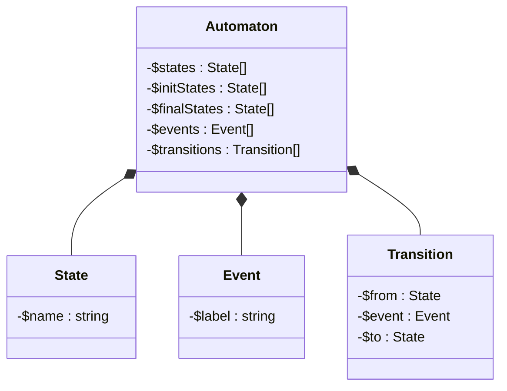

# ドメイン

## 概要

以下でドメインモデルが定義されています。

- Model

以下で値が定義されています。

- Value

## 依存関係

```mermaid
classDiagram
    %% ドメインモデル
    class Automaton {
        -$states : State[]
        -$initStates : State[]
        -$finalStates : State[]
        -$events : Event[]
        -$transitions : Transition[]
    }
    %% 値
    class State {
        -$name : string
    }
    class Event {
        -$label : string
    }
    class Transition {
        -$from : State
        -$event : Event
        -$to : State
    }
    %% 関係
    Automaton *-- State
    Automaton *-- Event
    Automaton *-- Transition
```

## 開発について

このディレクトリ内のものについてはフレームワークに依存しないようにしてください。
